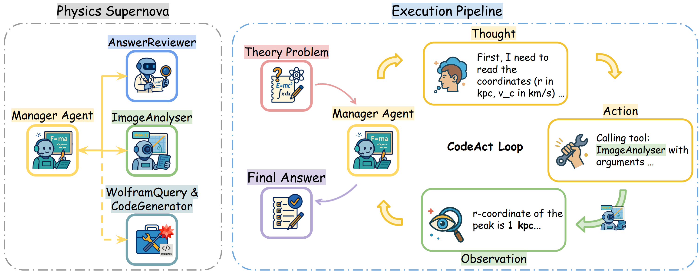
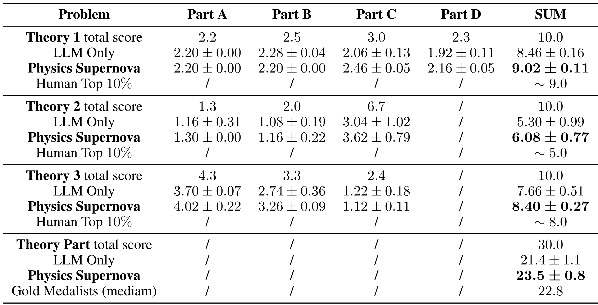
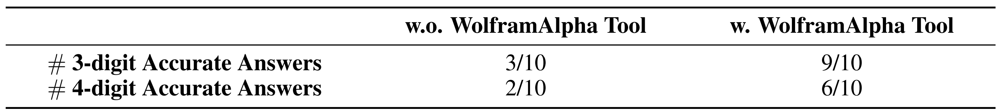

# Physics Supernova: AI Agent Matches Elite Gold Medalists at IPhO 2025 ⚙️

Physics Supernova is an agent system with strong Physics problem solving ability which matches elite gold medalists at IPhO 2025.

<p align="center">
  
</p>

## Features ✨

- **Agent Architectures:** 🛠️ CodeAgent manager coordinating Physics-oriented tools.
- **Physics Tooling:**
  - **ImageAnalyzer** 🔍 for accurate measurements from diagrams/plots.
  - **AnswerReviewer** ✅ for post-hoc checking and refinement.
  - **WolframAlpha Tool** ➗ for computation and unit work.
  - **Memory Summarizer** 🧠 for long multi-step problems.


---

## Setting up environments 🧰

### Python package installation 📦

Requires Python 3.10+.

```bash
python -m pip install -U pip
pip install tenacity             # retry logic for LiteLLM-backed models
pip install smolagents
pip install smolagents[litellm]
pip install loguru
pip install python-dotenv
```

---

### Set up API Keys 🔑

Set env vars in `.env`. As shown:

```bash
OPENROUTER_API_KEY=sk-...         # API key (openrouter is used by default)
WOLFRAM_APP_ID=...                # for WolframAlpha tool
HF_TOKEN=hf_...                   # if using HF-hosted models/tools
OPENROUTER_API_BASE=https://openrouter.ai/api/v1  # default; override if self-hosted or using other platforms
```

---

## Project Structure 🗂️

```txt
Physics-Supernova/
├── .env                            # put environment variables here
├── run.py                          # main entry
├── run_scripts/
│   ├── batchrun.py                 # concurrent batch running script for example problems
│   └── ...                         # other batch running scripts
├── judge_answer/
│   ├── call_llm_utils.py
│   ├── judge_answers.py
│   └── judge_answers.sh
├── utils/
│   ├── imgTools.py                 # Image Analyzer tool
│   ├── reviewTools.py              # Review Expert tool
│   ├── wolframTools.py             # WolframAlpha QA tool
│   ├── summemoryTools.py           # Memory summarization tool
│   └── markdown_utils.py
...
```

---

# Running Physics Supernova 🚀

## Getting started: single-run and batch-run ▶️

### Running entrance: `run.py` 🏁

**For a single problem at /path/to/physics_problem.md:**

```bash
python run.py   --input-markdown-file /path/to/physics_problem.md   --manager-model openrouter/google/gemini-2.5-pro   --manager-type CodeAgent   --tools-list wolfram_alpha_query ask_image_expert ask_review_expert finalize_part_answer   --image-tool-model openrouter/google/gemini-2.5-pro   --review-tool-model openrouter/google/gemini-2.5-pro   --summarize-tool-model openrouter/google/gemini-2.5-pro
```

**An example runnable script: (at `run_scripts/batchrun.py`)**
```bash
python run_scripts/batchrun.py
```

---

### Batch Execution 🧵

We provide scripts to run jobs (in parallel) in `run_scripts/batchrun.py`. Please edit the `MAX_THREADS` and `ARGS_LIST` in `batchrun.py` for your configurations.

1) Edit `run_scripts/batchrun.py`:

```python
MAX_THREADS = 2 # maximal parallel tasks
ARGS_LIST = [
    *[{
        "manager_model": "openrouter/google/gemini-2.5-flash",
        "image_tool_model": "openrouter/google/gemini-2.5-flash",
        "review_tool_model": "openrouter/google/gemini-2.5-flash",
        "summarize_tool_model": "openrouter/google/gemini-2.5-flash",
        "manager_type": "ToolCallingAgent",
        "tools_list": ["wolfram_alpha_query", "ask_image_expert", "ask_review_expert"],
        "input_markdown_file": "examples/Problems/example/example1problem.md",
        "output_file_position": f"output/example1problem_gemini-2.5-flash__ToolAgent_wolfimgreview_{idx}.md",
    } for idx in range(1, 4)],
]
```

2) Run:
```bash
python run_scripts/batchrun.py
```

**Default outputs are at ./output in batch scripts provided**.

---

## Detailed args for running experiments: ⚙️

**Basic**
- `--input-markdown-file` : Markdown problem file.
- `--output-file-position`: output file position
- `--manager-type`: `ToolCallingAgent` (default) | `CodeAgent`: Agent type
- `--manager-model`: LLM model to use for agent.


**Tools / Models**
- `--tools-list`: i.e. `wolfram_alpha_query ask_image_expert ask_review_expert finalize_part_answer`.
- `--image-tool-model`, `--review-tool-model`, `--summarize-tool-model`: corresponding LLM model to use for each tool


**Available Tools** 🧰

1) **WolframAlpha Tool** (`wolfram_alpha_query`) — numerical compute, unit conversion, exact/approx math.
2) **Image Expert Tool** (`ask_image_expert`) — accurate reading/measurement from plots/figures.
3) **Review Expert Tool** (`ask_review_expert`) — post-hoc checking, error localization, and fixes.
4) **Memory Summarization Tool** (`finalize_part_answer`) — summarizes and finalizes long, multi-step solutions.

---

## Experiments for IPhO 2025 Theory Problems and WolframAlpha QAs 📊

**IPhO-style Theory (Agent vs. Humans):** 🏆
- We have provided running script at `batchrun_IPhO.py`. Run:

```bash
python run_scripts/batch_IPhO.py
```

for running Physics Supernova on IPhO 2025 Theory Problems.

<p align="center">
  
</p>


**Expert-Knowledge Tasks with Wolfram|Alpha** 🧠📐
- We provided running script at `batchrun_wolftask.py`. Run:

```bash
python run_scripts/batchrun_wolftask.py
```

for running PHysics Supernova on wolframalpha-example problems.

<p align="center">
  
</p>

**Optional: Auto-Evaluate Wolfram|Alpha results**
- We provide auto-evaluating script at `judge_answer/judge_answers.sh`. By default, if you are running WolframAlpha scripts with unmodified `batchrun_wolftask.py`, you do not need to modify `judge_answer/judge_answers.sh` for a valid evaluation; simply run:

```bash
bash judge_answer/judge_answers.sh
```

; otherwise, you'll need to modify the `model_dir` to the output dir of models in `judge_answers.sh`.


---

## Acknowledgments 🙏

Built on [`smolagents`](https://github.com/huggingface/smolagents). Evaluation inspired by IPhO 2025 theory tasks.
